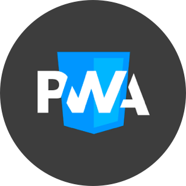
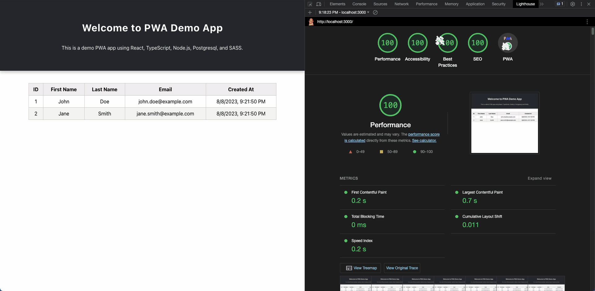

<!-- Begin README -->

<div align="center">
    <a href="https://scottgriv.github.io/pwa-demo_app/" target="_blank">
        
    </a>
</div>
<br>
<p align="center">
    <a href="https://react.dev/"></a>
    <a href="https://typescriptlang.org/"></a>
    <a href="https://www.postgresql.org/"></a>
    <br>
    <a href="https://nodejs.org/en/"></a>
    <a href="http://lesscss.org/"></a>
    <a href="https://sass-lang.com/"></a>
    <br>
    <a href="https://github.com/scottgriv"></a>
    <a href="mailto:scott.grivner@gmail.com"></a>
    <a href="https://www.buymeacoffee.com/scottgriv"></a>
    <br>
    <a href="https://prgportfolio.com" target="_blank"></a>
</p>

---------------

<h1 align="center">🖥️ PWA Demo 💻</h1>

A **Progressive Web App (PWA)** demo that uses React, TypeScript, Node.js, Postgresql, and Scss/Sass/Less.
- View a demo of the project on GitHub Pages **[Here](https://scottgriv.github.io/pwa-demo_app/)**.

<div align="center">
    <a href="https://scottgriv.github.io/pwa-demo_app/" target="_blank">
        
    </a>
    <br>
    <i>Application Preview</i>
</div>

---------------

## Table of Contents

- [Background Story](#background-story)
- [Definitions](#definitions)
- [Built With](#built-with)
- [Getting Started](#getting-started)
- [Notes](#notes)
  - [Service Worker](#service-worker)
  - [Manifest File](#manifest-file)
  - [Push Notifications (Optional)](#push-notifications-optional)
  - [Generate a Lighthouse Report](#generate-a-lighthouse-report)
  - [CSV vs. Postgresql Flag](#csv-vs-postgresql-flag)
  - [Less CSS Preprocessor](#less-css-preprocessor)
  - [Local Deployment vs. GitHub Pages](#local-deployment-vs-github-pages)
- [Resources](#resources)
  - [SPA, MPA, PWA Concepts](#spa-mpa-pwa-concepts)
  - [Technologies Referenced](#technologies-referenced)
- [License](#license)
- [Credits](#credits)

## Background Story

I wanted to demonstrate how to build a **PWA** that uses a database to store user data locally and syncs with a remote database when online. I also wanted to demonstrate how to use a service worker to cache the app shell and data as well as a manifest file to allow the user to install the app on their device.

## Definitions

To turn your website into a **PWA**, you'll need the following qualifications:
- **HTTPS** - Your site must be served over `HTTPS`. This is a requirement for service workers. If you don't have a certificate, you can use [Let's Encrypt](https://letsencrypt.org/). <br>
> [!NOTE]
> If you're deploying locally, you can still achieve a **PWA** by using `localhost`, but you won't be able to use a service worker or push notifications and it is strongly recommended that you use `HTTPS` for a production deployment.
- **Service Worker** - A [Service Worker](https://developers.google.com/web/fundamentals/primers/service-workers)) is a script that runs in the background and allows you to control how your app handles network requests and cache data. It also allows you to send push notifications to the user (see instructions below for more details).
- **Manifest File** - A manifest file is a `JSON` file that contains metadata about your app. It allows you to specify the name of your app, the icons that will be used when the app is installed on a device, the background color of the splash screen, and more (see instructions below for more details).
- **App Shell** - The app shell is the minimal `HTML`, `CSS`, and `JavaScript` required to power the user interface of your app. It is the first thing that is cached by the service worker and is used to provide a fast, reliable, and engaging experience for the user.
- **Offline Data Storage** - A **PWA** must be able to store data locally on the user's device. This allows the user to continue using the app when they are offline. When the user is online, the data should be synced with a remote database.
- **Responsive Design** - A **PWA** must be responsive and work on all devices.

## Built With

I used the following technologies to build this app:
- React (Frontend)
- TypeScript (JavaScript)
- Node.js (Backend/Server)
- Postgresql (Database)
- Scss/Sass/Less (CSS Preprocessors)
- Workbox Package (Service Worker)
- PWA Asset Generator Package (Manifest File)
- NPM (Package Manager)
- Webpack (Module Bundler)

> [!NOTE]
> By default, the application uses `client/src/App.scss` to style the application.
> The `App.sass` and `App.css` (compiled from Less) can be used as well, they're interchangable.
> Simply uncomment out the line for the CSS Preprocessor you want to use in the `client/src/components/UserTable.tsx` file.

## Getting Started

1. Install Postgresql and create a database named `pwa_db_web_app`.
- Use the `database.sql` file to create the tables and insert the data.
2. Change your directory to the project directory and run the following commands:
- Start the server:
```bash
cd server
npm install
npm start
```
- Start the client:
```bash
cd client
npm install
npm start
```
3. Open your browser and navigate to http://localhost:3000.

## Notes

### Service Worker

- I used [**Workbox**](https://developers.google.com/web/tools/workbox/) to generate the service worker file. To do this, I installed **Workbox** in the client directory:
```bash
npm install workbox-cli --global
```
- Then generate the service worker file by running:
```bash
npx workbox generateSW workbox-config.js
```

### Manifest File

- Use [**PWA Asset Generator**](https://github.com/elegantapp/pwa-asset-generator) to automatically generate `JSON` for your `manisfest.json` file as well as the `icons` for your logo to make it **PWA** complicit.
- To install **PWA Asset Generator** run:
```bash
npm install -g pwa-asset-generator
```
- Then create a logo.png file in the root directory of your project. The logo should be at least 512x512 pixels. <br> 
> [!TIP]
> The logo should be square and have a transparent background.
- Then run (*Assuming you are in the directory your logo file is in*):
```bash
npx pwa-asset-generator logo.png icons
```
*The images will be created in the icons directory*.

### Push Notifications (Optional)

- To send [**Push Notifications**](https://developers.google.com/web/fundamentals/push-notifications), you'll need to create a **VAPID** key pair. You can do this by running the following command:
```bash
npx web-push generate-vapid-keys
```
- Then copy the **VAPID** key pair and paste it into the `server/src/routes/notifications.ts` file.
- Then run the following command to start the server:
```bash
npm start
```
- Then open your browser and navigate to http://localhost:3000.
- Then open the Chrome Dev Tools and click on the Application tab.
- Then click on the Service Workers tab -> Push link -> Subscribe button -> Allow button.
- Then copy the **Endpoint** and paste it into the `server/src/routes/notifications.ts` file.
- Then run the following command to send a push notification:
```bash
curl -X POST -H "Content-Type: application/json" -d "{\"title\": \"Hello World\", \"body\": \"This is a test notification\"}" http://localhost:3001/notifications
```
- Then you should see a push notification in your browser.

### Generate a Lighthouse Report

- [**Lighthouse**](https://developers.google.com/web/tools/lighthouse) is an open-source, automated tool for improving the quality of web pages. You can run it against any web page, public or requiring authentication. It has audits for performance, accessibility, progressive web apps, and more.
- To generate a **Lighthouse** report, open your browser and navigate to http://localhost:3000.
- Then open the Chrome Dev Tools and click on the **Lighthouse** tab.
- Click on the Generate Report button.
- I achieved the following perfect scores:
  - Performance: 100
  - Accessibility: 100
  - Best Practices: 100
  - SEO: 100
  - Progressive Web App: 100
- References to the **Lighthouse** Report files are located in the [docs](docs) directory.

### CSV vs. Postgresql Flag

- By default, I'm parsing the table from a **Comma-separated values (CSV)** file located in the `client/src/data` directory for hosting purposes. You can change this to use **Postgresql** by modifying the `client/src/App.tsx` file flag to `false` here: 

```typescript
 const useCsv = true;
 ```

 ### Less CSS Preprocessor

 - To use Less, install the package via npm:
 ```bash
 npm install -g less
```
- Then, change your directory to the `src` folder where the `App.less` file exists and run the following command to generate the `.css` file:
```bash
lessc App.less App.css
```
- Be sure to uncomment out the `.css` import in the `client/src/components/UserTable.tsx` file.

 ### Local Deployment vs. GitHub Pages
 
  - By default, I'm deploying the app to **GitHub Pages**. You can change this to deploy the app locally or to your own **GitHub Pages** by modifying the following files:
  
  1.  `/client/package.json` <br>

      **Local:** 
      ```json
      "homepage": "http://localhost:3000",
      ```
      **GitHub Pages:**
      ```json
      "homepage": "https://{your_github_username}.github.io/{your_repository_name}/",
      ```

  2. `/client/src/index.tsx` <br>

      **Local:** 
      ```typescript
      navigator.serviceWorker.register('/service-worker.js').then(registration => {
      ```
      **GitHub Pages:**
      ```typescript
      navigator.serviceWorker.register('/{your_repository_name}/service-worker.js').then(registration => {
      ```

  3. `/client/public/index.html` <br>

      **Local:** 
      ```html
      <link rel="manifest" href="/manifest.json">
      ```

      **GitHub Pages:**
      ```html
      <link rel="manifest" href="/{your_repository_name}/manifest.json">
      ```

  4. `/client/public/manifest.json` <br>

      **Local:** 
      ```json
      "start_url": ".",
      ```
      **GitHub Pages:**
      ```json
      "start_url": "/{your_repository_name}/",
      ```

- Then `cd client/public` from the root directory and run the following command to deploy to **GitHub Pages**:

  ```bash
  npm run deploy
  ```

- If you're unfamiliar with deploying a static site to **GitHub Pages**, you can read more about it here: [**GitHub Pages**](https://pages.github.com/).

## Resources

### SPA, MPA, PWA Concepts

- [**Progressive Web Apps**](https://web.dev/progressive-web-apps/)
- [**Wikipedia - Progressive Web App**](https://en.wikipedia.org/wiki/Progressive_web_app)
- [**Single-Page Applications vs Multi-Page Applications: The Battle of the Web Apps**](https://themindstudios.com/blog/spa-vs-mpa/)
- [**Single Page Application (SPA) vs Multi Page Application (MPA): Which Is The Best?**](https://cleancommit.io/blog/spa-vs-mpa-which-is-the-king/)

### Technologies Referenced

- [**Service Workers**](https://developers.google.com/web/fundamentals/primers/service-workers)
- [**Workbox**](https://developers.google.com/web/tools/workbox/)
- [**PWA Asset Generator**](https://github.com/elegantapp/pwa-asset-generator)
- [**Push Notifications**](https://developers.google.com/web/fundamentals/push-notifications)
- [**Lighthouse**](https://developers.google.com/web/tools/lighthouse)
- [**GitHub Pages**](https://pages.github.com/)
- [**Let's Encrypt**](https://letsencrypt.org/)
- [**Postgresql**](https://www.postgresql.org/)
- [**React**](https://reactjs.org/)
- [**TypeScript**](https://www.typescriptlang.org/)
- [**Node.js**](https://nodejs.org/en/)
- [**Scss**](https://blog.logrocket.com/the-definitive-guide-to-scss/)
- [**Sass**](https://sass-lang.com/)
- [**Less**](http://lesscss.org/)
- [**NPM**](https://www.npmjs.com/)
- [**Webpack**](https://webpack.js.org/)

**Happy Coding!**

## License

This project is released under the terms of the **MIT License**, which permits use, modification, and distribution of the code, subject to the conditions outlined in the license.
- The [MIT License](https://choosealicense.com/licenses/mit/) provides certain freedoms while preserving rights of attribution to the original creators.
- For more details, see the [LICENSE](LICENSE) file in this repository. in this repository.

## Credits

**Author:** [Scott Grivner](https://github.com/scottgriv) <br>
**Email:** [scott.grivner@gmail.com](mailto:scott.grivner@gmail.com) <br>
**Website:** [scottgrivner.dev](https://www.scottgrivner.dev) <br>
**Reference:** [Main Branch](https://github.com/scottgriv/pwa-demo_app) <br>

---------------

<div align="center">
    <a href="https://scottgrivner.dev" target="_blank">
        
    </a>
</div>

<!-- End README -->